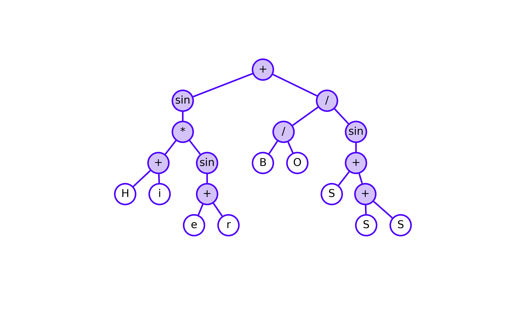
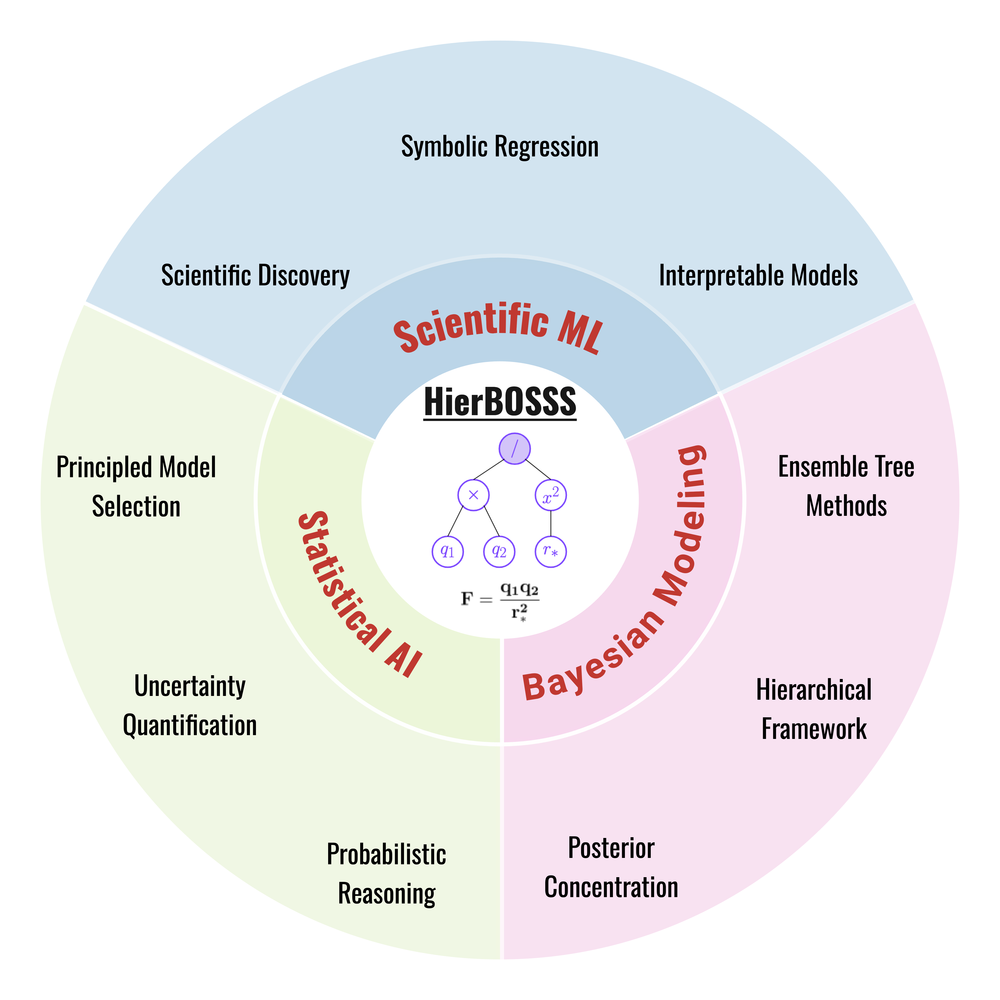
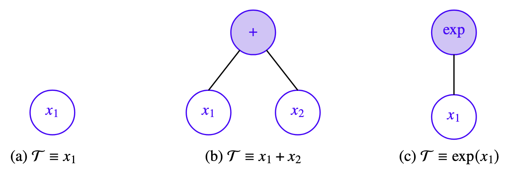
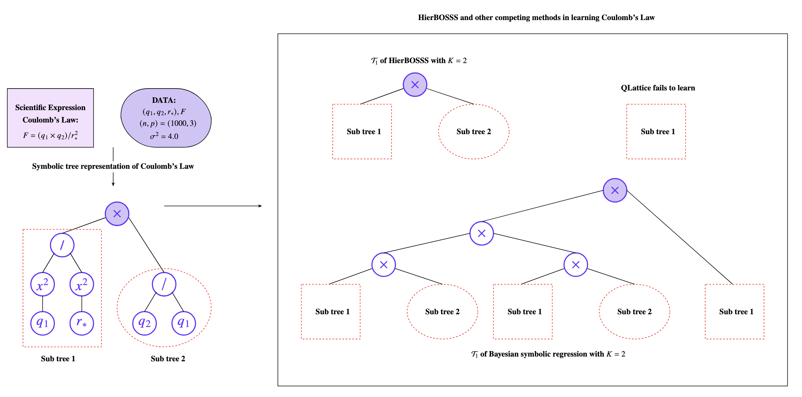

# _HierBOSSS_: Hierarchical Bayesian Operator-induced Symbolic Regression Trees for Structural Learning of Scientific Expressions

  

This repository holds the source code and implementation of **HierBOSSS** for Bayesian structural learning of scientific symbolic expressions.

---

  

  
  <em>HierBOSSS bridges Scientific Machine Learning and Statistical Artificial Intelligence through Bayesian structural learning of scientific expressions.</em>

  
  <em>Figure 1: Symbolic tree representation of scientific expressions.</em>

  

**HierBOSSS** models symbolic expressions through an operator-induced sum-of-symbolic trees. Conjugate priors are assigned to model regression parameters, while a regularizing prior is designed for the individual symbolic tree structures. To perform inference from the HierBOSSS-induced posterior distribution, we develop an efficient Metropolis-within-partially-collapsed Gibbs Markov chain Monte Carlo (MCMC) sampling algorithm.

  

<figure align="center">
  
  <figcaption><em>Figure 2: Comparing HierBOSSS with competing symbolic regression methods in learning the Coulomb's law.</em></figcaption>
</figure>

---

## Installation and Dependencies

To get started with HierBOSSS, where the initial version is programmed using the `R` software, install the following dependencies:

* `listenv`
* `dplyr`
* `ggplot2`
* `reshape2`
* `tidyr`
* `mvtnorm`
* `scales`
* `tidyverse`
* `ggpmisc`

---

## Functionality and Components of the HierBOSSS Module

The backend of `HierBOSSS` is mainly moduled in the `R` scripts, [MCMC.R](./MCMC.R) and [tree_functions.R](./tree_functions.R).

* [tree_functions.R](./tree_functions.R): This `R` script implements the core symbolic tree structural representation of scientific symbolic expressions modeled by the HierBOSSS framework. It defines reference classes for operators and nodes, and provides a comprehensive set of functions to perform different tree operations as listed below.

| **Component**                              | **Type**            | **Functionality**                                                                                                                                                                                    |
| ------------------------------------------ | ------------------- | ---------------------------------------------------------------------------------------------------------------------------------------------------------------------------------------------------- |
| **Symbolic Tree Utilities ([tree_functions.R](./tree_functions.R))**    |                     |                                                                                                                                                                                                      |
| **Operator (class)**                       | Reference class     | Defines an operator with name, function, and arity (unary/binary).                                                                                                                                   |
| **Node (class)**                           | Reference class     | Represents a symbolic tree node (type, depth, operator, feature, parent/children, data).                                                                                                             |
| `deepcopy(node)`                           | Helper              | Creates a deep copy of a symbolic tree from a given node.                                                                                                                                            |
| `grow(node, …)`                            | Recursive           | Recursively grows a tree using operator/feature weights, splitting probability, and max depth.                                                                                                       |
| `genList(node)`                            | Tree traversal      | Stores tree nodes in a list and assigns order indices.                                                                                                                                               |
| `shrink(node, …)`                          | Tree edit           | Converts a non-terminal node into a terminal node.                                                                                                                                                   |
| `upgOd(Tree)`                              | Helper              | Updates the order indices of nodes in a tree.                                                                                                                                                        |
| `allcal(node, indata)`                     | Evaluation          | Computes the output of a symbolic tree for given input data.                                                                                                                                         |
| `display(Tree)`                            | Visualization       | Prints the symbolic tree structure by depth (operators/features).                                                                                                                                    |
| `getHeight(node)`                          | Property            | Returns the maximum depth (height) of a tree.                                                                                                                                                        |
| `getNum(node)`                             | Property            | Returns the total number of nodes in a tree.                                                                                                                                                         |
| `upDepth(Root)`                            | Recursive           | Updates depth attributes of all nodes starting from root.                                                                                                                                            |
| `Express(node)`                            | Expression builder  | Generates algebraic expression string of the symbolic tree.                                                                                                                                          |
| `tree_lik(node, …)`                        | Likelihood helper   | Computes counts of operator uses and feature assignments.                                                                                                                                            |
| `get_all_terminal(node)`                   | Traversal           | Returns paths to all terminal nodes.                                                                                                                                                                 |
| `access_terminal(path, node)`              | Accessor            | Accesses a specific terminal node by path string.                                                                                                                                                    |
| `get_all_nonterminal(node)`                | Traversal           | Returns paths to all non-terminal nodes.                                                                                                                                                             |
| `access_nonterminal(path, node)`           | Accessor            | Accesses a specific non-terminal node by path string.                                                                                                                                                |
| `tree_log_likelihood_val(node, …)`         | Likelihood          | Computes the log-likelihood of a tree structure under prior weights.                                                                                                                                 |
| `tree_log_proposal_likelihood(…)`          | Proposal            | Computes proposal likelihood for grow/shrink moves (used in MH steps).                                                                                                                               |

* [MCMC](./MCMC.R): This `R` script implements the Metropolis-within-partially-collapsed Gibbs sampling algorithm to sample from the HierBOSSS-induced posterior distribution. It integrates the symbolic tree utilities from [tree_functions.R](./tree_functions.R) and provides the full posterior sampling routine. The components of [MCMC.R](./MCMC.R) and their corresponding functionalities are highlighted below.

| **Component**                              | **Type**            | **Functionality**                                                                                                                                                                                    |
| ------------------------------------------ | ------------------- | ---------------------------------------------------------------------------------------------------------------------------------------------------------------------------------------------------- |
| **Posterior Sampler ([MCMC.R](./MCMC.R))** |                     |                                                                                                                                                                                                      |
| `update_tree_parameters(…)`                | Gibbs update        | Updates operator weights (`W_op`) and feature weights (`W_ft`) via Dirichlet distributions.                                                                                                          |
| `update_model_parameters(…)`               | Collapsed Gibbs     | Updates regression coefficients $\beta$ and variance $\sigma^2$ using Normal–Inverse-Gamma conjugacy.                                                                                                      |
| `log_normalizing_constant(…)`              | Marginal term       | Computes log normalizing constant after integrating out $\beta$ and $\sigma^2$.                                                                                                                                    |
| `update_tree_MH(…)`                        | Metropolis–Hastings | Proposes grow/shrink moves on symbolic trees and accepts/rejects based on Metropolis-Hastings ratio.                                                                                                           |
| `HierBOSSS(…)`                             | Main driver         | Runs the **Metropolis-within-partially-collapsed Gibbs sampler**: initializes forests, updates weights, performs MH tree updates, updates $\beta$ and $\sigma^2$, computes marginal likelihood, and stores chains in `env_`. |

---

