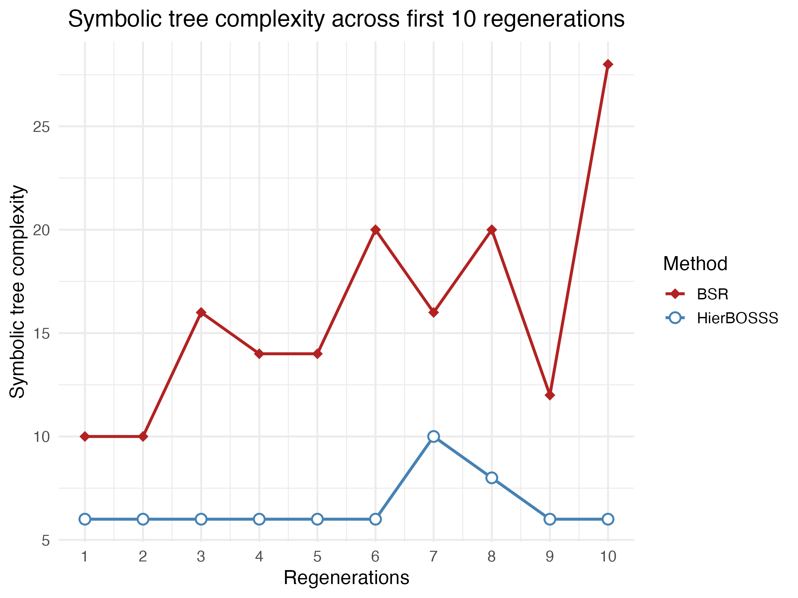
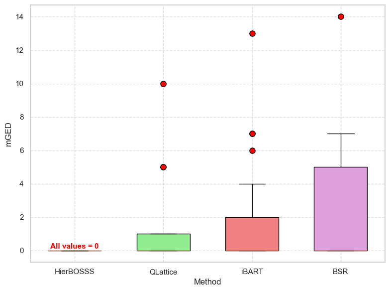
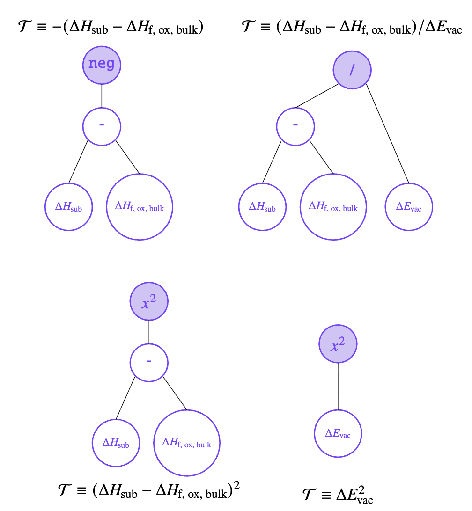

# HierBOSSS: Hierarchical Bayesian Operator-induced Symbolic Regression Trees for Structural Learning of Scientific Expressions

  

This repository holds the source code and implementation of **HierBOSSS** for Bayesian structural learning of scientific symbolic expressions.

---

## Overview

The advent of Scientific Machine Learning (SciML) has heralded a transformative era in scientific discovery, driving progress across diverse domains. Central to this progress is uncovering scientific laws from experimental data through symbolic regression. However, existing approaches are dominated by heuristic algorithms or data-hungry black-box methods, which often demand low-noise settings and lack principled uncertainty quantification. Motivated by interpretable statistical artificial intelligence (AI), we develop a hierarchical Bayesian framework for symbolic regression that represents scientific laws as ensembles of tree-structured symbolic expressions endowed with a regularized tree prior. This coherent probabilistic formulation enables full posterior inference via an efficient Markov chain Monte Carlo algorithm, yielding a balance between predictive accuracy and structural parsimony. To guide symbolic model selection, we develop a marginal posterior–based criterion adhering to the Occam’s window principle, and further quantify structural fidelity to ground truth through a tailored expression-distance metric. On the theoretical front, we establish a near-minimax rate of Bayesian posterior concentration, providing the first rigorous guarantee in context of symbolic regression. Empirical evaluation demonstrates robust performance of our proposed methodology against state-of-the-art competing modules on a simulated example, a suite of canonical Feynman equations, and single-atom catalysis dataset.

  

<figure align="center">
  
  <figcaption><em>HierBOSSS bridges the gap between SciML and Statistical AI in context of symbolic regression.</em></figcaption>
</figure>

  

<figure align="center">
  
  <figcaption><em>Figure 1: Symbolic tree representation of scientific expressions.</em></figcaption>
</figure>

  

**HierBOSSS** models symbolic expressions through an ensemble of symbolic tree-structured scientific expressions (see Figure 1), regarded as the symbolic forest component. Conjugate priors are assigned to model regression parameters, while a regularizing prior is designed for the individual symbolic tree structures. To perform inference from the HierBOSSS-induced posterior distribution, we develop an efficient Metropolis-within-partially-collapsed Gibbs Markov chain Monte Carlo (MCMC) sampling algorithm. The success of HierBOSSS in discovering interpretable scientific laws is showcased. Specifically, we demonstrate HierBOSSS' ability to recover and learn well-known physics-based Feynman equations and identify meaningful descriptors in single-atom catalysis. Moreover, HierBOSSS consistently outperforms state-of-the-art symbolic regression methods (which often suffer from training data size, noise, and overly complicated symbolic expressions), offering advantages both in symbolic expression discovery and computational efficiency.

  

<figure align="center">
  
  <figcaption><em>Figure 2: Comparing HierBOSSS with competing symbolic regression methods in learning the Coulomb's law.</em></figcaption>
</figure>

---

## Installation and Dependencies

To get started with HierBOSSS, install the following required dependencies:

* `listenv`
* `dplyr`
* `ggplot2`
* `reshape2`
* `tidyr`
* `mvtnorm`
* `scales`
* `tidyverse`
* `ggpmisc`

For running the competing methods:

1. `iBART`: is moduled on `R`, which can be installed using `install.packages('iBART')` along with the following dependencies:
- `bartMachine`
- `bartMachineJARs`
- `rJava`
- `remotes`

Check [https://github.com/mattsheng/iBART](https://github.com/mattsheng/iBART) for detailed setup instructions.

2. `BSR`: *Bayesian symbolic regression* (BSR) ([Jin et al., 2020](https://arxiv.org/abs/1910.0889)) has been built on `Python`. The folder [BSR](./BSR) contains the entire setup and experimental settings used across different applications considered.

3. `QLattice`: is available through the `Python` package `feyn`. See [https://docs.abzu.ai/](https://docs.abzu.ai/) and [QLattice](./QLattice) for detailed instructions on setup and explore QLattice's application to various experiments and numerical studies.

---

## Functionality and Components of the HierBOSSS Module

The backend of `HierBOSSS` is mainly moduled in the `R` scripts, [MCMC.R](./MCMC.R) and [tree_functions.R](./tree_functions.R).

* [tree_functions.R](./tree_functions.R): This `R` script implements the core symbolic tree structural representation of scientific symbolic expressions modeled by the HierBOSSS framework. It defines reference classes for operators and nodes, and provides a comprehensive set of functions to perform different tree operations as listed below.

| **Component**                              | **Type**            | **Functionality**                                                                                                                                                                                    |
| ------------------------------------------ | ------------------- | ---------------------------------------------------------------------------------------------------------------------------------------------------------------------------------------------------- |
| **Symbolic Tree Utilities ([tree_functions.R](./tree_functions.R))**    |                     |                                                                                                                                                                                                      |
| **Operator (class)**                       | Reference class     | Defines an operator with name, function, and arity (unary/binary).                                                                                                                                   |
| **Node (class)**                           | Reference class     | Represents a symbolic tree node (type, depth, operator, feature, parent/children, data).                                                                                                             |
| `deepcopy(node)`                           | Helper              | Creates a deep copy of a symbolic tree from a given node.                                                                                                                                            |
| `grow(node, …)`                            | Recursive           | Recursively grows a tree using operator/feature weights, splitting probability, and max depth.                                                                                                       |
| `genList(node)`                            | Tree traversal      | Stores tree nodes in a list and assigns order indices.                                                                                                                                               |
| `shrink(node, …)`                          | Tree edit           | Converts a non-terminal node into a terminal node.                                                                                                                                                   |
| `upgOd(Tree)`                              | Helper              | Updates the order indices of nodes in a tree.                                                                                                                                                        |
| `allcal(node, indata)`                     | Evaluation          | Computes the output of a symbolic tree for given input data.                                                                                                                                         |
| `display(Tree)`                            | Visualization       | Prints the symbolic tree structure by depth (operators/features).                                                                                                                                    |
| `getHeight(node)`                          | Property            | Returns the maximum depth (height) of a tree.                                                                                                                                                        |
| `getNum(node)`                             | Property            | Returns the total number of nodes in a tree.                                                                                                                                                         |
| `upDepth(Root)`                            | Recursive           | Updates depth attributes of all nodes starting from root.                                                                                                                                            |
| `Express(node)`                            | Expression builder  | Generates algebraic expression string of the symbolic tree.                                                                                                                                          |
| `tree_lik(node, …)`                        | Likelihood helper   | Computes counts of operator uses and feature assignments.                                                                                                                                            |
| `get_all_terminal(node)`                   | Traversal           | Returns paths to all terminal nodes.                                                                                                                                                                 |
| `access_terminal(path, node)`              | Accessor            | Accesses a specific terminal node by path string.                                                                                                                                                    |
| `get_all_nonterminal(node)`                | Traversal           | Returns paths to all non-terminal nodes.                                                                                                                                                             |
| `access_nonterminal(path, node)`           | Accessor            | Accesses a specific non-terminal node by path string.                                                                                                                                                |
| `tree_log_likelihood_val(node, …)`         | Likelihood          | Computes the log-likelihood of a tree structure under prior weights.                                                                                                                                 |
| `tree_log_proposal_likelihood(…)`          | Proposal            | Computes proposal likelihood for grow/shrink moves (used in MH steps).                                                                                                                               |

* [MCMC](./MCMC.R): This `R` script implements the Metropolis-within-partially-collapsed Gibbs sampling algorithm to sample from the HierBOSSS-induced posterior distribution. It integrates the symbolic tree utilities from [tree_functions.R](./tree_functions.R) and provides the full posterior sampling routine. The components of [MCMC.R](./MCMC.R) and their corresponding functionalities are highlighted below.

| **Component**                              | **Type**            | **Functionality**                                                                                                                                                                                    |
| ------------------------------------------ | ------------------- | ---------------------------------------------------------------------------------------------------------------------------------------------------------------------------------------------------- |
| **Posterior Sampler ([MCMC.R](./MCMC.R))** |                     |                                                                                                                                                                                                      |
| `update_tree_parameters(…)`                | Gibbs update        | Updates operator weights (`W_op`) and feature weights (`W_ft`) via Dirichlet distributions.                                                                                                          |
| `update_model_parameters(…)`               | Collapsed Gibbs     | Updates regression coefficients $\beta$ and variance $\sigma^2$ using Normal–Inverse-Gamma conjugacy.                                                                                                      |
| `log_normalizing_constant(…)`              | Marginal term       | Computes log normalizing constant after integrating out $\beta$ and $\sigma^2$.                                                                                                                                    |
| `update_tree_MH(…)`                        | Metropolis–Hastings | Proposes grow/shrink moves on symbolic trees and accepts/rejects based on Metropolis-Hastings ratio.                                                                                                           |
| `HierBOSSS(…)`                             | Main driver         | Runs the **Metropolis-within-partially-collapsed Gibbs sampler**: initializes forests, updates weights, performs MH tree updates, updates $\beta$ and $\sigma^2$, computes marginal likelihood, and stores chains in `env_`. |

---

## HierBOSSS in Action

We present three broad applications of HierBOSSS and investigate its ability in learning and discovering scientific symbolic expressions across a simulated example and diverse scientific domains.

1. **A Simulated Example**

* Data-generating symbolic expression: $\mathbf{y} = 5(x_1 + x_2) + \epsilon,\epsilon \sim \mathcal{N}_n(0_n, \sigma^{2} I_n)$; with $x_1 \sim \mathcal{N}_n(4\mathbf{1}_n, I_n), x_2\sim \mathcal{N}_n(6\mathbf{1}_n, I_n), x_3\sim \mathcal{N}_n(8\mathbf{1}_n, I_n)$.

* HierBOSSS accurately recovers the true data-generating expression while maintaining a low RMSE (see Figure 3).

* Outperforms competing symbolic regression methods (Bayesian symbolic regression (BSR), QLattice, and iBART; see Figures 4 and 5) by consistently identifying simpler, interpretable symbolic trees guided by the joint marginal posterior model selection (Occam's window).

* In terms of computational efficiency, HierBOSSS significantly records lower runtimes when comapared to BSR and iBART while comparing well with the machine learning module QLattice (see Figure 6).

For detailed analysis of the simulated example, see:  

| **Category**        | **Files / Notebooks** |
|:-------------------:|:----------------------|
| HierBOSSS Implementation | [HierBOSSS_simulated_example.R](./HierBOSSS_simulated_example.R) |
| Results Output      | [results/simulated_example](./results/simulated_example) |
| Competing Methods   | [BSR/Simulated_example.ipynb](./BSR/Simulated_Example.ipynb), [QLattice.ipynb](./QLattice/QLattice.ipynb) |
| Runtime Comparisons | [runtimes/simulated_example](./runtimes/simulated_example) |
| mGED Computation | [GED](./GED) |

  

<figure align="center">
  
  <figcaption><em>Figure 3: RMSE of over 25 data regenrations.</em></figcaption>
</figure>

  

<figure align="center">
  
  <figcaption><em>Figure 4: Expression complexity.</em></figcaption>
</figure>

  

<figure align="center">
  
  <figcaption><em>Figure 5: Structural proximity with the true simulated example.</em></figcaption>
</figure>

  

<figure align="center">
  
  <figcaption><em>Figure 6: Runtime comparisons.</em></figcaption>
</figure>

  

2. **Learning Feynman Equations**

* Applied to popular physical laws such as **Coulomb's Law** $(F=(q_1\times q_2)/r_*^2)$, **Lorentz Force** $(F = q\times (E_f + B\times v\times \sin \theta))$, and **Gravitational Potential Energy** $(\Delta U = m_1\times m_2\times (1/r_2 - 1/r_1))$.

* HierBOSSS consistently identifies (learns) the correct symbolic forms of these physics laws (structural proximity studied using mGED), even under introduction of different levels of noise in the data.

* Competing methods either overfit producing unduly complex expressions (Bayesian symbolic regression (BSR)), fail under noise (QLattice), or encounter computational issues (iBART).

* HierBOSSS achieves superior predictive accuracy while preserving interpretability.

[HierBOSSS_Feynman_equations.R](./HierBOSSS_Feynman_equations.R) comprises the full implementation of HierBOSSS and iBART under different experimental settings when applied to learn the Feynman equations. Demonstration of the competing methods are available in [BSR](./BSR/) for Bayesian symbolic regression (BSR) and [QLattice](./QLattice/) for QLattice.

  

<figure align="center">
  
  <figcaption><em>Figure 7: HierBOSSS learns the symbolic tree structures of the scientific laws defined by Feynman equations.</em></figcaption>
</figure>

  

3. **Single-atom Catalysis Data Study**

* The central task is to identify meaningful descriptors linking physical/chemical properties of metal-oxide pairs to binding energy ([O'Connor et al., 2018](https://www.nature.com/articles/s41929-018-0094-5)).

* HierBOSSS efficiently learns interpretable descriptors that align with domain knowledge while reducing RMSE compared to LASSO*, Bayesian symbolic regression (BSR), QLattice, and iBART.

Explore [single_atom_data_analysis](./single_atom_data_analysis/), [BSR/Single-Atom Catalysis for BSR.ipynb](./BSR/Single-Atom%20Catalysis%20for%20BSR%20test.ipynb), and [QLattice/Single-Atom catalysis.ipynb](./QLattice/Single-Atom%20catalysis.ipynb) for the complete data study.

  

<figure align="center">
  
  <figcaption><em>Figure 8:  Out-of-sample RMSE values across different symbolic trees K.</em></figcaption>
</figure>

  

<figure align="center">
    
    <figcaption><em>Figure 9: Some important descriptors learned by HierBOSSS influencing the binding energy in single-atom catalysis dataset.</em></figcaption>
</figure>

---

